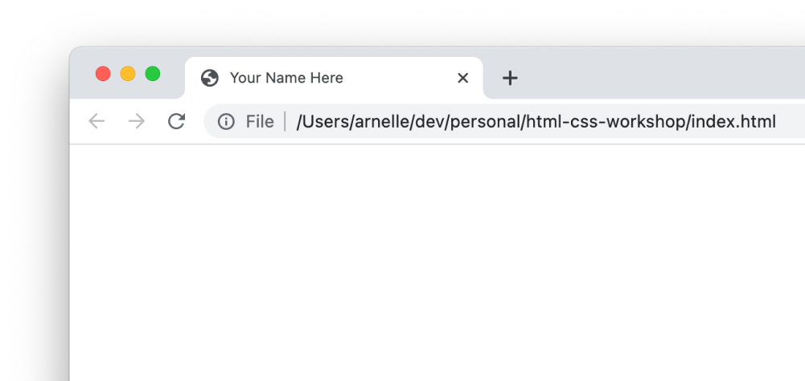
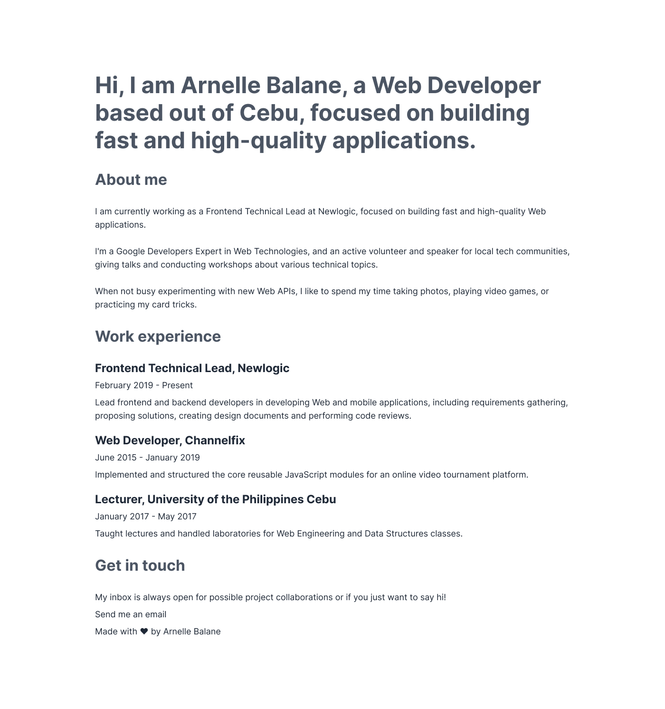
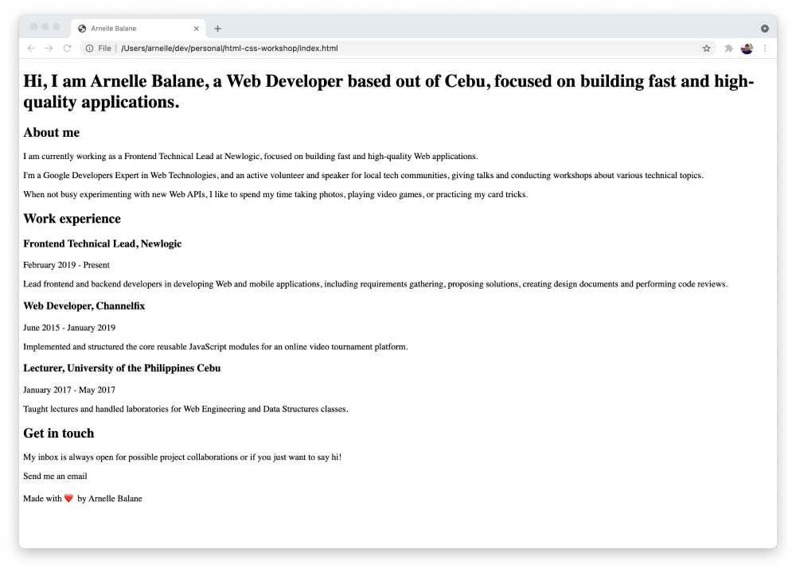

# Our First Page

Now that we know what what HTML is and what HTML code looks like, let's create our first HTML page.

In our code editor, create a new file called `index.html`

> If using CodeSandbox, this file should already exist when the sandbox was created. Just delete all the contents of this file.

Add the following code to `index.html` to create the foundation of our HTML page.

```html
<!DOCTYPE html>
<html>
  <head>
    <title>Your Name Here</title>
  </head>

  <body></body>
</html>
```

- `<!DOCTYPE html>`: For now, all we need to know is that this indicates that we are writing HTML5 code.
- `<html></html>`: The [`<html>`](https://developer.mozilla.org/en-US/docs/Web/HTML/Element/html) element. Represents the entire HTML page.
- `<head></head>`: The [`<head>`](https://developer.mozilla.org/en-US/docs/Web/HTML/Element/head) element. Contains information about the HTML page that isn't the content that we are showing to the page's visitors. This includes things like the title of the HTML page, page metadata, styling information, and many others.
- `<title></title>`: The [`<title>`](https://developer.mozilla.org/en-US/docs/Web/HTML/Element/title) element. Sets the title of our HTML page, and is the title that's displayed in the browser tab when we open our page.
- `<body></body>`: The [`<body>`](https://developer.mozilla.org/en-US/docs/Web/HTML/Element/body) element. Contains all the contents that we want to show to the page's visitors, whether that's text, images, videos, or anything else.

Let's open our HTML page in our browser to see what it looks like. For now, double clicking on the `index.html` file from our File Explorer app should be enough.



As expected, it's empty for now (although notice the page title in the browser tab!). Let's add some contents to it!

## Add Page Contents

Since we are building our personal portfolio site, our page should contain information about us. Let's add the contents below into `index.html`. Please replace any example information with actual information about you. The image below is also in Figma, in the **01 - Content** page.



> We can quickly copy-paste the text above from [this page](https://snippets.arnellebalane.com/raw/GYxsj).

One goal when writing HTML is to markup content using the appropriate HTML elements. In our example, the contents so far are all text. These texts are either headings or paragraphs.

### Headings

Heading elements allow you to specify that certain parts of your content are headings or subheadings. HTML contains 6 heading levels, [`<h1> - <h6>`](https://developer.mozilla.org/en-US/docs/Web/HTML/Element/Heading_Elements).

```html
<h1>Our main title</h1>
<h2>Our top level heading</h2>
<h3>Our subheading</h3>
<h4>Our sub-subheading</h4>
```

Identify which are the headings in our HTML page template and mark them up accordingly.

### Paragraphs

To represent paragraphs in HTML, we use the [`<p>`](https://developer.mozilla.org/en-US/docs/Web/HTML/Element/p).

```html
<p>This is a single paragraph</p>
```

Identify which are the paragraphs in our HTML page template and mark them up accordingly.

## View Page Contents

After adding the page contents and marking them up with the appropriate HTML elements, refresh the browser tab to see the results. We can compare our code with the [final code](https://github.com/arnellebalane/skourse-html-css-workshop/blob/01-content/index.html) for this lesson.



It still doesn't look very nice for now, but the most important thing is already there - **content and information that tells the page's visitors about us**.

In the next lessons we will work on making it look more presentable.
